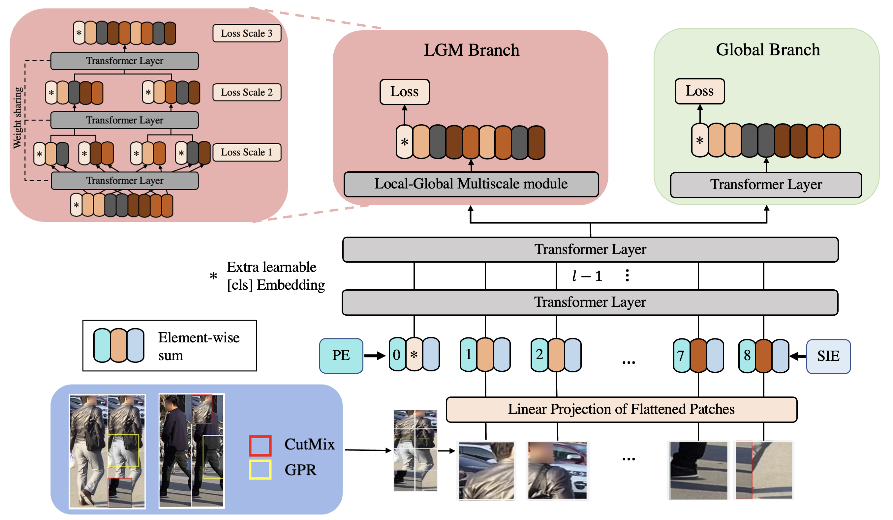
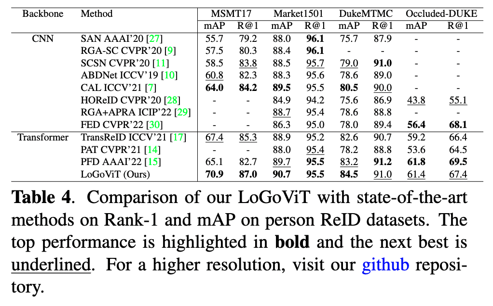
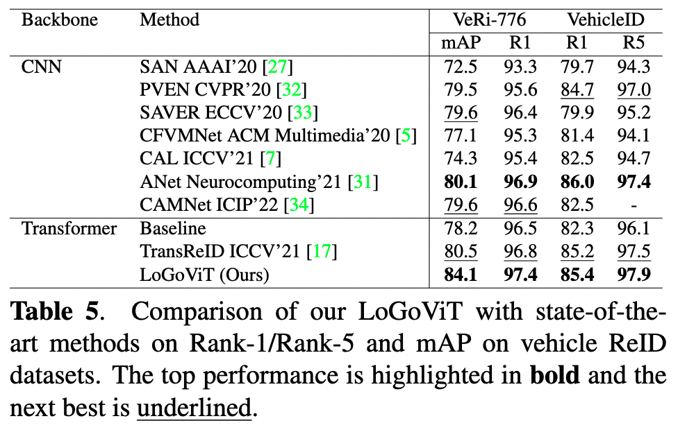

# LoGoViT
Official implementation of LoGoViT: Local-Global Vision Transformer for Object Re-identification.

# Acknowledgement
Code is based on 
https://github.com/damo-cv/TransReID \
https://github.com/rwightman/pytorch-image-models \
https://github.com/michuanhaohao/reid-strong-baseline
